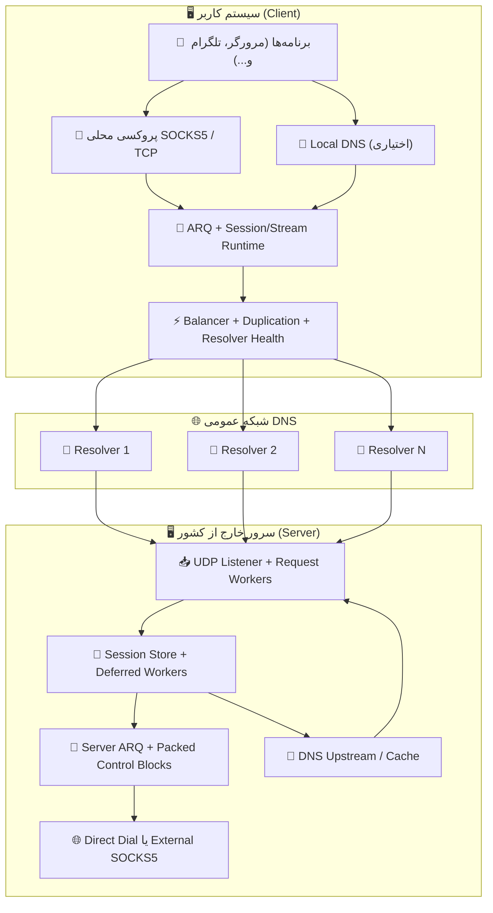
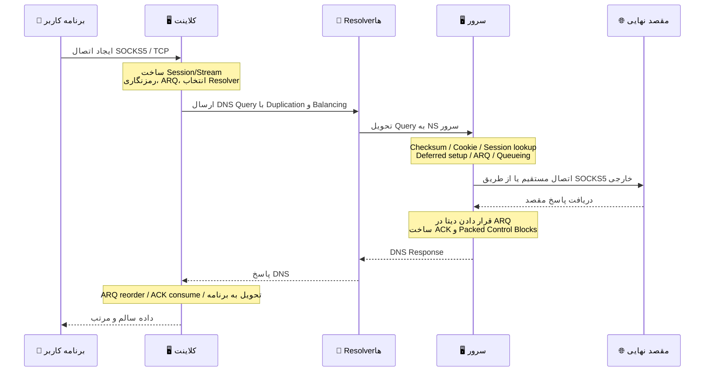

# پروژه MasterDnsVPN 🔐

## | [نسخه فارسی](https://github.com/masterking32/MasterDnsVPN/blob/main/README_FA.MD) | [English Version](https://github.com/masterking32/MasterDnsVPN/blob/main/README.MD) |

پروژه **MasterDnsVPN** یک پروژهٔ علمی-تحقیقاتی برای انتقال داده‌های TCP از طریق درخواست‌ها و پاسخ‌های DNS است. این پروژه در هدف کلی شبیه پروژه‌هایی مانند DNSTT یا SlipStream است، اما از نظر ساختار و روش پیاده‌سازی تفاوت‌های بنیادین دارد و رویکرد متفاوتی را دنبال می‌کند.
پیاده‌سازی این سیستم بر پایهٔ سازگاری با انواع شبکه‌ها و رزولورها و نیز توانایی تحمل محدودیت‌های شدید طراحی شده است، تا در بدترین شرایط ممکن بالاترین میزان انتقال داده و بیشترین پایداری را فراهم کند.

### 📊  مقایسه MasterDnsVPN با پروژه‌های مشابه:

| ویژگی | SlipStream | DNSTT | MasterDnsVPN |
| :--- | :--- | :--- | :--- |
| نوع پروتکل | DNS Tunnel پیشرفته | DNS Tunnel کلاسیک | DNS Tunnel / VPN پیشرفته |
| پروتکل انتقال | QUIC | KCP + Noise | پروتکل اختصاصی + ARQ |
| سربار هدرهای انتقالی | 🟠 ~24B | 🔴 ~59B | 🟢 ~5–7B (≈88% کمتر از DNSTT، ≈71% کمتر از SlipStream) |
| نوع رمزنگاری | TLS 1.3 (در QUIC) | Noise (Curve25519) | AES / ChaCha20 / XOR (در صورت استفاده از XOR: امنیت نسبی ولی بدون سربار اضافی) |
| معماری | یکپارچه (QUIC همه‌چیز را پوشش می‌دهد) | چندلایه (KCP + SMUX + Noise) | طراحی اختصاصی سبک، بهینه برای DNS |
| کارایی (سرعت) | 🟡 بالا (تا ~5× سریع‌تر از DNSTT) | 🔴 متوسط | 🟢 سازگار با شرایط بسیار بد؛ سریعتر از بقیه در شرایط مشابه |
| پایداری در Packet Loss | 🟡 خوب | 🟠 متوسط | 🟢 بسیار بالا (Multipath + ARQ) |
| استفاده از چند DNS resolver | بله (multipath) | ❌ | بله — پیشرفته (multi-resolver + duplication) |
| تحمل سانسور شدید | خوب | متوسط | بسیار قوی (هدف اصلی پروژه) |
| پیچیدگی راه‌اندازی | متوسط | ساده | ساده؛ اما با پیکربندی پیشرفته قابل تنظیم و کمی پیچیده‌تر |
| پشتیبانی SOCKS5 | بله | بله | بهینه‌شده برای SOCKS5 / SOCKS4 |
| پشتیبانی Shadowsocks | ✅ | ❌ | غیرمستقیم: در حالت TCP Forwarding از پروتکل‌های TCP پشتیبانی می‌کند |
| Multipath واقعی | بله (QUIC multipath) | ❌ | بله (multi-resolver + duplication) |
| Adaptive routing | محدود | ❌ | پیشرفته (مبتنی بر latency/loss) |
| هدف طراحی | سرعت و کارایی بالا | سادگی و پایداری | عبور از محدودترین شبکه‌ها — پایداری، سرعت و کارایی |
| زبان پیاده‌سازی | Rust | Go | Python و Go |
| بالانسر داخلی | 🔴 | ❌ | 🟢 (4 نوع بالانسر داخلی) |
| سیستم Duplication | ❌ | ❌ | بله — افزایش ترافیک برای تضمین پایداری (قابل تنظیم) |
| MTU قابل پشتیبانی | بهتر از DNSTT | - | سازگار حتی با MTU کم به دلیل سربار بسیار پایین پروتکل |
| سیستم Failover | ❌ | ❌ | ✅ |
| سرعت دانلود 10 مگابایت در حالت لوکال | 🟡 0.978 ثانیه | 🔴 2.492 ثانیه | 🟢 0.270 ثانیه |
| سرعت آپلود 10 مگابایت در حالت لوکال | 🟡 3.249 ثانیه | 🔴 16.207 ثانیه  | 🟢 1.746 ثانیه |
| قابلیت فشرده سازی | ❌ | ❌ | 🟢<br> به سه روش مختلف قابل تنظیم<br>Off, ZSTD, LZ4, ZLIB |
| بررسی سلامت رزولورها و غیرفعال‌سازی خودکار | ❌ | ❌ | ✅ |
| بازفعال‌سازی رزولورها در صورت دسترسی دوباره (پس‌زمینه) | ❌ | ❌ | ✅ |
| ارائه DNS محلی در کلاینت (جلوگیری از DNS Hijacking) | ❌ | ❌ | ✅ (با DNS Caching حرفه‌ای برای کاهش درخواست‌ها) |
| قابلیت DNS resolving از طریق SOCKS5 | ❌ | ❌ | ✅ (با DNS Caching) |
| امکان پیکربندی حرفه‌ای و دلخواه | 🟠 | 🟠 | 🟢 امکان پیکربندی دقیق تمام بخش‌ها |
| بی‌نیاز از نرم‌افزارهای جانبی | ❌ | ❌ | 🟢 نیازی به نصب نرم‌افزار جانبی نیست؛ در صورت نیاز می‌توانید از SOCKS یا ابزارهای خارجی مانند Shadowsocks یا OpenVPN استفاده کنید. |

---

### ❌ رفع مسئولیت (Disclaimer):
پروژه MasterDnsVPN صرفاً یک ایدهٔ علمی و آموزشی است و بر همین اساس طراحی و پیاده‌سازی شده است.

- **ارائه بدون ضمانت:** این نرم‌افزار «همان‌طور که هست» (AS-IS) و بدون هیچ‌گونه ضمانت صریح یا ضمنی، از جمله ضمانت قابلیت فروش، مناسب‌بودن برای هدف خاص یا عدم نقض حقوق، ارائه می‌شود.
- **محدودیت مسئولیت:** توسعه‌دهندگان و مشارکت‌کنندگان این پروژه هیچ‌گونه مسئولیتی در قبال خسارات مستقیم، غیرمستقیم، تبعی، اتفاقی یا هر نوع خسارت دیگری ناشی از استفاده یا ناتوانی در استفاده از این نرم‌افزار نمی‌پذیرند.
- **مسئولیت کاربر:** استفاده از این پروژه در محیط‌های غیرآزمایشگاهی ممکن است به ساختار شبکه آسیب برساند. کاربر به‌تنهایی مسئول هرگونه پیامد ناشی از نصب، پیکربندی و استفاده از این نرم‌افزار است.
- **رعایت قوانین:** استفاده از این پروژه برای دور زدن قوانین کشورها می‌تواند با مسئولیت‌های مدنی و کیفری همراه باشد. لطفاً پیش از استفاده، قوانین و مقررات کشور خود را در این زمینه به‌دقت بررسی کنید. توسعه‌دهندگان هیچ مسئولیتی در قبال نقض قوانین محلی، ملی یا بین‌المللی توسط کاربران نمی‌پذیرند.
- **مجوز استفاده:** استفاده، کپی، توزیع یا تغییر این نرم‌افزار مشمول شرایط مجوز مندرج در فایل `LICENSE` این مخزن است. هرگونه استفاده خارج از چارچوب آن مجوز ممنوع است.

---

## کانال اطلاع‌رسانی و پشتیبانی 📢

برای دریافت آخرین اخبار، نسخه‌ها و اطلاعیه‌های پروژه، کانال تلگرام ما را دنبال کنید: [Telegram Channel](https://t.me/masterdnsvpn)

---

### اگر از پروژه راضی‌اید، با دادن ستاره (⭐) در گیت‌هاب از ما حمایت کنید — این کار به دیده‌شدن پروژه کمک می‌کند.

---

### حمایت مالی (اختیاری) 💸

- شبکه TON:

`masterking32.ton`

- آدرس روی شبکه‌های EVM (ETH و سازگارها): 

`0x517f07305D6ED781A089322B6cD93d1461bF8652`

- شبکه TRC20 (TRON):

`TLApdY8APWkFHHoxebxGY8JhMeChiETqFH`

از هر نوع حمایت و بازخورد شما سپاسگزاریم — کمک‌ها برای توسعه و بهبود پروژه بسیار ارزشمند است.

---

## ویژگی‌های کلیدی و مزایا ✨

نمای کلی و مختصر از قابلیت‌های اصلی MasterDnsVPN:

- **عبور از سانسور و تحمل شرایط سخت شبکه:** 🛡️ طراحی‌شده برای کار در شبکه‌های دارای فیلترینگ، قطعی و محدودیت MTU.
- **پروتکل سبک و کم‌سربار:** 🔄 پروتکل اختصاصی با مکانیزم ارسال مجدد برای کاهش سربار و افزایش ظرفیت داده در DNS.
- **قابلیت Multipath و تکثیر بسته‌ها:** 📡 ارسال همزمان از مسیرهای مختلف و تکثیر انتخابی برای افزایش شانس تحویل در شبکه‌های ناپایدار.
- **انتخاب هوشمند رزولورها و بررسی سلامت:** ⚡ انتخاب بر اساس کیفیت و وضعیت رزولورها و مدیریت خودکار رزولورهای مشکل‌دار.
- **کشف و همگام‌سازی MTU:** 🧰 تشخیص MTU عملیاتی مسیرها و تنظیم برای کاهش fragmentation و افزایش پایداری.
- **پشتیبانی و بهینه‌سازی SOCKS5/SOCKS4:** 🧦 مسیردهی و پردازش بهینه ترافیک پراکسی محلی برای برنامه‌ها.
- **تجمیع کنترل‌ها و کاهش سربار پاسخ‌ها:** 📦 جمع‌آوری ACK و پیام‌های کنترلی در یک پکت برای کاهش ترافیک کنترل.
- **فشرده‌سازی و تجمیع درخواست‌ها (اختیاری):** 🗜️ کاهش تعداد درخواست‌ها و افزایش بهره‌وری در شرایط MTU کوچک.
- **رمزنگاری انعطاف‌پذیر:** 🔐 پشتیبانی از چند الگوریتم رمزنگاری برای متعادل‌سازی سرعت و امنیت.
- **قابلیت DNS محلی و کشینگ در کلاینت:** 📛 ارائه DNS محلی، کاهش تأخیر و جلوگیری از حملات hijack.
- **مقیاس‌پذیری و کنترل منابع:** ⚙️ قابل اجرا از سرورهای کم‌منابع تا محیط‌های با بار زیاد.

این فهرست نمای کلی و مختصری از قابلیت‌هاست؛ برای جزئیات بیشتر به بخش‌های مرتبط در همین سند مراجعه کنید.

---

# راه‌اندازی و شروع بکار 🧑‍💻


## بخش ۱: 🖥️ راه‌اندازی سرور

### بخش ۱.۱: 🌐 راه‌اندازی و آماده‌سازی دامنه (پیش‌نیاز) 

برای دریافت مستقیم درخواست‌های DNS روی سرور باید یک زیردامنه را به سرورتان واگذار (delegate) کنید. به‌صورت خلاصه دو رکورد بسازید: یک رکورد `A` برای آدرس سرور و یک رکورد `NS` که زیردامنه را به آن A ارجاع دهد.

#### گام ۱.۱.۱: 🅰️ ساخت رکورد A (آدرس سرور) 

- **نوع:** `A`
- **نام:** نام کوتاه مثل `ns`
- **مقدار:** آدرس IPv4 سرور شما

> مثال: `ns.example.com -> 1.2.3.4`

> در Cloudflare - ⚠️ نکته سریع: اگر دامنه روی Cloudflare است، در صفحه `DNS` روی آیکون ابر کنار رکورد `A` کلیک کنید تا خاکستری (DNS only) شود؛ نباید Proxied (نارنجی) باشد.

#### گام ۱.۱.۲: 🏷️ ساخت رکورد NS (واگذاری زیردامنه)

- **نوع:** `NS`
- **نام:** زیردامنه‌ی تونل مثل `v`
- **مقدار (Target):** `ns.example.com`

> مثال: `v.example.com -> ns.example.com`

> در Cloudflare - ⚠️ نکته سریع: رکورد `NS` را اضافه کنید؛ Cloudflare رکورد NS را پروکسی نمی‌کند، فقط مطمئن شوید رکورد `ns` قبلاً روی DNS only قرار دارد.

#### بخش ۱.۱.۳: 💡 نکتهٔ کوتاه دربارهٔ MTU

هر چه نام‌های دامنه کوتاه‌تر باشند، فضای بیشتری برای داده در هر DNS request باقی می‌ماند. برای throughput بهتر از نام‌های کوتاه استفاده کنید. اگر از Cloudflare استفاده می‌کنید، باز هم رکوردها را DNS only نگه دارید.

---

### بخش ۱.۲: 🐧 نصب سریع سرور لینوکس

#### گام ۱.۲.۱: نصب خودکار (اسکریپت)

اگر قصد دارید سرور را روی یک سیستم لینوکسی راه‌اندازی کنید، ساده‌ترین راه استفاده از اسکریپت نصب خودکار است. کافی است دستور زیر را در ترمینال سرور وارد کنید:

```bash
bash <(curl -Ls https://raw.githubusercontent.com/masterking32/MasterDnsVPN/main/server_linux_install.sh)
```

این اسکریپت مراحل نصب و پیکربندی را خودکار انجام می‌دهد. بعد از پایان نصب، سرور اجرا می‌شود و **کلید رمزنگاری** در لاگ ترمینال نمایش داده می‌شود و همچنین در فایل `encrypt_key.txt` کنار فایل اجرایی ذخیره می‌گردد — این کلید را در جای امن نگه دارید.

#### گام ۱.۲.۲: نکات مهم پس از نصب

- در هنگام نصب از شما آدرس دامنه پرسیده می‌شود؛ باید همان زیردامنه‌ای باشد که در رکورد `NS` تنظیم کرده‌اید (مثلاً `v.example.com`).
- پس از ایجاد رکوردهای DNS، تا انتشار آن‌ها صبر کنید (ممکن است از چند دقیقه تا چند ساعت یا در موارد خاص تا 48 ساعت طول بکشد؛ بسته به TTL).
- برای بررسی صحت تنظیمات DNS می‌توانید از ابزارهایی مانند `dig` یا `nslookup` استفاده کنید (مثلاً `dig v.example.com NS` یا `nslookup -type=ns v.example.com`). برای پرس‌وجو مستقیم از nameserver جدید: `dig @ns.example.com v.example.com A`.
- اگر فایروال سرور فعال است، اجازه‌ی عبور UDP پورت 53 را بدهید. نمونه برای `ufw`:

```bash
sudo ufw allow 53/udp
sudo ufw reload
```

برای `firewalld`:

```bash
sudo firewall-cmd --add-port=53/udp --permanent
sudo firewall-cmd --reload
```

- اگر پورت `53` توسط سرویس دیگری اشغال شده باشد (مثلاً `systemd-resolved` در برخی توزیع‌ها)، راه‌حل را در بخش «رفع مشکل اشغال بودن پورت ۵۳» ببینید.
- کلید رمزنگاری (`encrypt_key.txt`) پس از نصب نمایش داده می‌شود؛ آن را کپی و امن نگه دارید، زیرا برای اتصال کلاینت لازم است.

---

## بخش ۲: 🚀 نصب و راه‌اندازی (کلاینت و سرور) 

شما می‌توانید این پروژه را به دو روش نصب و اجرا کنید:

1. استفاده از فایل‌های کامپایل‌شدهٔ آماده (مناسب اکثر کاربران)
2. اجرای مستقیم از روی سورس با **Go** (مناسب توسعه دهندگان)

---

### بخش ۲.۱: استفاده از نسخه‌های کامپایل‌شده (✅ روش پیشنهادی)

برای راحتی شما، فایل‌های اجرایی کلاینت و سرور از قبل در releaseها منتشر می‌شوند. کافی است نسخه مناسب سیستم‌عامل خود را دانلود و از حالت فشرده خارج کنید.

> 💡 **نکته:** بسته‌های release معمولاً شامل فایل اجرایی و فایل‌های نمونه‌ی کانفیگ هستند.

#### لینک‌های دانلود کلاینت (Client) 📥

| سیستم‌عامل (OS) | پردازنده (Architecture) | مناسب برای سیستم‌های... | لینک دانلود مستقیم |
| :--- | :--- | :--- | :--- |
| ویندوز (Windows) 🪟 | `AMD64` (64-bit) | ویندوز ۱۰ و ۱۱ | [دانلود نسخه ویندوز ⬇️](https://github.com/masterking32/MasterDnsVPN/releases/latest/download/MasterDnsVPN_Client_Windows_AMD64.zip) |
| ویندوز (Windows) 🪟 | `x86` (32-bit) | سیستم‌های قدیمی ۳۲ بیتی ویندوز | [دانلود نسخه ویندوز x86 ⬇️](https://github.com/masterking32/MasterDnsVPN/releases/latest/download/MasterDnsVPN_Client_Windows_X86.zip) |
| ویندوز (Windows) 🪟 | `ARM64` | دستگاه‌های ویندوزی مبتنی بر ARM | [دانلود نسخه ویندوز ARM64 ⬇️](https://github.com/masterking32/MasterDnsVPN/releases/latest/download/MasterDnsVPN_Client_Windows_ARM64.zip) |
| مک‌اواس (macOS) 🍎 | `ARM64` | مک‌های جدید (سری M1 / M2 / M3) | [دانلود نسخه مک (Apple Silicon) ⬇️](https://github.com/masterking32/MasterDnsVPN/releases/latest/download/MasterDnsVPN_Client_MacOS_ARM64.zip) |
| مک‌اواس (macOS) 🍎 | `AMD64` | مک‌های اینتل | [دانلود نسخه مک اینتل ⬇️](https://github.com/masterking32/MasterDnsVPN/releases/latest/download/MasterDnsVPN_Client_MacOS_AMD64.zip) |
| لینوکس (Linux) 🐧 | `AMD64` (64-bit) | توزیع‌های جدید (اوبونتو ۲۲.۰۴+، دبیان ۱۲+) | [دانلود نسخه لینوکس (جدید) ⬇️](https://github.com/masterking32/MasterDnsVPN/releases/latest/download/MasterDnsVPN_Client_Linux_AMD64.zip) |
| لینوکس (Linux) 🐧 | `x86` (32-bit) | سیستم‌های قدیمی ۳۲ بیتی لینوکس | [دانلود نسخه لینوکس x86 ⬇️](https://github.com/masterking32/MasterDnsVPN/releases/latest/download/MasterDnsVPN_Client_Linux_X86.zip) |
| لینوکس (Legacy) 🐧 | `AMD64` (64-bit) | توزیع‌های قدیمی (اوبونتو ۲۰.۰۴، دبیان ۱۱) | [دانلود نسخه لینوکس (سازگاری بالا) ⬇️](https://github.com/masterking32/MasterDnsVPN/releases/latest/download/MasterDnsVPN_Client_Linux-Legacy_AMD64.zip) |
| لینوکس (Legacy) 🐧 | `ARM64` | سیستم‌های ARM64 قدیمی‌تر که سازگاری بیشتری می‌خواهند | [دانلود نسخه لینوکس Legacy ARM64 ⬇️](https://github.com/masterking32/MasterDnsVPN/releases/latest/download/MasterDnsVPN_Client_Linux-Legacy_ARM64.zip) |
| لینوکس (ARM) 🐧 | `ARM64` | سرورهای ARM، رزبری‌پای و بردهای مشابه | [دانلود نسخه لینوکس (ARM) ⬇️](https://github.com/masterking32/MasterDnsVPN/releases/latest/download/MasterDnsVPN_Client_Linux_ARM64.zip) |
| لینوکس (ARM) 🐧 | `ARMv7` | بردهای ARM ۳۲ بیتی و دستگاه‌های قدیمی‌تر | [دانلود نسخه لینوکس ARMv7 ⬇️](https://github.com/masterking32/MasterDnsVPN/releases/latest/download/MasterDnsVPN_Client_Linux_ARMV7.zip) |
| لینوکس (ARM) 🐧 | `ARMv6` | بردهای ARM قدیمی‌تر و سیستم‌های سبک لینوکسی | [دانلود نسخه لینوکس ARMv6 ⬇️](https://github.com/masterking32/MasterDnsVPN/releases/latest/download/MasterDnsVPN_Client_Linux_ARMV6.zip) |
| لینوکس (ARM) 🐧 | `ARMv5` | دستگاه‌های ARM خیلی قدیمی و سیستم‌های embedded | [دانلود نسخه لینوکس ARMv5 ⬇️](https://github.com/masterking32/MasterDnsVPN/releases/latest/download/MasterDnsVPN_Client_Linux_ARMV5.zip) |
| لینوکس (Linux) 🐧 | `RISCV64` | بردها و سرورهای لینوکسی مبتنی بر RISC-V | [دانلود نسخه لینوکس RISCV64 ⬇️](https://github.com/masterking32/MasterDnsVPN/releases/latest/download/MasterDnsVPN_Client_Linux_RISCV64.zip) |
| لینوکس (MIPS) 🐧 | `MIPS` | سیستم‌ها و روترهای لینوکسی MIPS با endian بزرگ | [دانلود نسخه لینوکس MIPS ⬇️](https://github.com/masterking32/MasterDnsVPN/releases/latest/download/MasterDnsVPN_Client_Linux_MIPS.zip) |
| لینوکس (MIPS) 🐧 | `MIPSLE` | سیستم‌ها و روترهای لینوکسی MIPS با endian کوچک | [دانلود نسخه لینوکس MIPSLE ⬇️](https://github.com/masterking32/MasterDnsVPN/releases/latest/download/MasterDnsVPN_Client_Linux_MIPSLE.zip) |
| لینوکس (MIPS) 🐧 | `MIPS64` | سیستم‌های ۶۴ بیتی MIPS با endian بزرگ | [دانلود نسخه لینوکس MIPS64 ⬇️](https://github.com/masterking32/MasterDnsVPN/releases/latest/download/MasterDnsVPN_Client_Linux_MIPS64.zip) |
| لینوکس (MIPS) 🐧 | `MIPS64LE` | سیستم‌های ۶۴ بیتی MIPS با endian کوچک | [دانلود نسخه لینوکس MIPS64LE ⬇️](https://github.com/masterking32/MasterDnsVPN/releases/latest/download/MasterDnsVPN_Client_Linux_MIPS64LE.zip) |
| ترموکس / اندروید 📱 | `ARM64` | گوشی‌های اندرویدی جدید با Termux | [دانلود نسخه ترموکس ARM64 ⬇️](https://github.com/masterking32/MasterDnsVPN/releases/latest/download/MasterDnsVPN_Client_Termux_ARM64.zip) |
| ترموکس / اندروید 📱 | `ARMv7` | گوشی‌های قدیمی‌تر با محیط ۳۲ بیتی Termux | [دانلود نسخه ترموکس ARMv7 ⬇️](https://github.com/masterking32/MasterDnsVPN/releases/latest/download/MasterDnsVPN_Client_Termux_ARMV7.zip) |

#### لینک‌های دانلود سرور (Server) 📤

*(اگر نمی‌خواهید از اسکریپت نصب خودکار لینوکس استفاده کنید.)*

| سیستم‌عامل (OS) | پردازنده (Architecture) | مناسب برای سیستم‌های... | لینک دانلود مستقیم |
| :--- | :--- | :--- | :--- |
| ویندوز (Windows) 🪟 | `AMD64` (64-bit) | ویندوز سرور، ویندوز ۱۰ و ۱۱ | [دانلود سرور ویندوز ⬇️](https://github.com/masterking32/MasterDnsVPN/releases/latest/download/MasterDnsVPN_Server_Windows_AMD64.zip) |
| ویندوز (Windows) 🪟 | `x86` (32-bit) | سیستم‌های قدیمی ۳۲ بیتی ویندوز | [دانلود سرور ویندوز x86 ⬇️](https://github.com/masterking32/MasterDnsVPN/releases/latest/download/MasterDnsVPN_Server_Windows_X86.zip) |
| ویندوز (Windows) 🪟 | `ARM64` | دستگاه‌های ویندوزی مبتنی بر ARM | [دانلود سرور ویندوز ARM64 ⬇️](https://github.com/masterking32/MasterDnsVPN/releases/latest/download/MasterDnsVPN_Server_Windows_ARM64.zip) |
| لینوکس (Linux) 🐧 | `AMD64` (64-bit) | سرورهای اوبونتو ۲۲.۰۴+، دبیان ۱۲+ | [دانلود سرور لینوکس (جدید) ⬇️](https://github.com/masterking32/MasterDnsVPN/releases/latest/download/MasterDnsVPN_Server_Linux_AMD64.zip) |
| لینوکس (Linux) 🐧 | `x86` (32-bit) | سیستم‌های قدیمی ۳۲ بیتی لینوکس | [دانلود سرور لینوکس x86 ⬇️](https://github.com/masterking32/MasterDnsVPN/releases/latest/download/MasterDnsVPN_Server_Linux_X86.zip) |
| لینوکس (Legacy) 🐧 | `AMD64` (64-bit) | سرورهای قدیمی (اوبونتو ۲۰.۰۴، دبیان ۱۱) | [دانلود سرور لینوکس (سازگاری بالا) ⬇️](https://github.com/masterking32/MasterDnsVPN/releases/latest/download/MasterDnsVPN_Server_Linux-Legacy_AMD64.zip) |
| لینوکس (Legacy) 🐧 | `ARM64` | سیستم‌های ARM64 قدیمی‌تر که سازگاری بیشتری می‌خواهند | [دانلود سرور لینوکس Legacy ARM64 ⬇️](https://github.com/masterking32/MasterDnsVPN/releases/latest/download/MasterDnsVPN_Server_Linux-Legacy_ARM64.zip) |
| لینوکس (ARM) 🐧 | `ARM64` | سرورهای ARM | [دانلود سرور لینوکس (ARM) ⬇️](https://github.com/masterking32/MasterDnsVPN/releases/latest/download/MasterDnsVPN_Server_Linux_ARM64.zip) |
| لینوکس (ARM) 🐧 | `ARMv7` | سرورهای ARM ۳۲ بیتی و دستگاه‌های embedded | [دانلود سرور لینوکس ARMv7 ⬇️](https://github.com/masterking32/MasterDnsVPN/releases/latest/download/MasterDnsVPN_Server_Linux_ARMV7.zip) |
| لینوکس (ARM) 🐧 | `ARMv6` | بردهای ARM قدیمی‌تر و سیستم‌های سبک لینوکسی | [دانلود سرور لینوکس ARMv6 ⬇️](https://github.com/masterking32/MasterDnsVPN/releases/latest/download/MasterDnsVPN_Server_Linux_ARMV6.zip) |
| لینوکس (ARM) 🐧 | `ARMv5` | دستگاه‌های ARM خیلی قدیمی و سیستم‌های embedded | [دانلود سرور لینوکس ARMv5 ⬇️](https://github.com/masterking32/MasterDnsVPN/releases/latest/download/MasterDnsVPN_Server_Linux_ARMV5.zip) |
| لینوکس (Linux) 🐧 | `RISCV64` | بردها و سرورهای لینوکسی مبتنی بر RISC-V | [دانلود سرور لینوکس RISCV64 ⬇️](https://github.com/masterking32/MasterDnsVPN/releases/latest/download/MasterDnsVPN_Server_Linux_RISCV64.zip) |
| لینوکس (MIPS) 🐧 | `MIPS` | سیستم‌ها و روترهای لینوکسی MIPS با endian بزرگ | [دانلود سرور لینوکس MIPS ⬇️](https://github.com/masterking32/MasterDnsVPN/releases/latest/download/MasterDnsVPN_Server_Linux_MIPS.zip) |
| لینوکس (MIPS) 🐧 | `MIPSLE` | سیستم‌ها و روترهای لینوکسی MIPS با endian کوچک | [دانلود سرور لینوکس MIPSLE ⬇️](https://github.com/masterking32/MasterDnsVPN/releases/latest/download/MasterDnsVPN_Server_Linux_MIPSLE.zip) |
| لینوکس (MIPS) 🐧 | `MIPS64` | سیستم‌های ۶۴ بیتی MIPS با endian بزرگ | [دانلود سرور لینوکس MIPS64 ⬇️](https://github.com/masterking32/MasterDnsVPN/releases/latest/download/MasterDnsVPN_Server_Linux_MIPS64.zip) |
| لینوکس (MIPS) 🐧 | `MIPS64LE` | سیستم‌های ۶۴ بیتی MIPS با endian کوچک | [دانلود سرور لینوکس MIPS64LE ⬇️](https://github.com/masterking32/MasterDnsVPN/releases/latest/download/MasterDnsVPN_Server_Linux_MIPS64LE.zip) |
| مک‌اواس (macOS) 🍎 | `ARM64` | مک‌های جدید (سری M1 / M2 / M3) | [دانلود سرور مک (Apple Silicon) ⬇️](https://github.com/masterking32/MasterDnsVPN/releases/latest/download/MasterDnsVPN_Server_MacOS_ARM64.zip) |
| مک‌اواس (macOS) 🍎 | `AMD64` | مک‌های اینتل | [دانلود سرور مک اینتل ⬇️](https://github.com/masterking32/MasterDnsVPN/releases/latest/download/MasterDnsVPN_Server_MacOS_AMD64.zip) |
| ترموکس / اندروید 📱 | `ARM64` | محیط‌های جدید اندروید / Termux | [دانلود سرور ترموکس ARM64 ⬇️](https://github.com/masterking32/MasterDnsVPN/releases/latest/download/MasterDnsVPN_Server_Termux_ARM64.zip) |
| ترموکس / اندروید 📱 | `ARMv7` | محیط‌های قدیمی‌تر اندروید / Termux ۳۲ بیتی | [دانلود سرور ترموکس ARMv7 ⬇️](https://github.com/masterking32/MasterDnsVPN/releases/latest/download/MasterDnsVPN_Server_Termux_ARMV7.zip) |

---

### بخش ۲.۲: 🪟 آماده‌سازی و اجرای کلاینت در ویندوز

- پس از دانلود نسخه مربوط به ویندوز آن را از حالت فشرده خارج کنید.
- فایل client_config.toml را با ویرایشگر متن نظیر Notepad باز کنید.
- در این فایل بجای مقادیر پیش‌فرض، مقادیر زیر را تنظیم کنید:
  - مقدار `ENCRYPTION_KEY` را با کلیدی که در هنگام نصب سرور دریافت کرده‌اید یکی کنید (یا محتوای `encrypt_key.txt` سرور را در اینجا قرار دهید).
  - مقدار `DOMAINS` را با دامنه‌ای که در رکورد NS تنظیم کرده‌اید یکی کنید (مثلاً `["v.example.com"]` و باید با رکورد NS سرور یکی باشد).
- فایل `client_resolvers.txt` را باز کنید و لیست رزولورها (resolvers) را وارد کنید؛ هر خط یک رزولور با فرمت `IP`، `IP:PORT`، `CIDR` یا `CIDR:PORT` (مثلاً `8.8.8.8` یا `8.8.8.8:53`).

> ⚠️ **نکته:**  شما باید لیست رزولورهایی که قابلیت انتقال اطلاعات به سرور شما را دارند پیدا کنید و در این فایل قرار دهید.

- سپس فایل `MasterDnsVPN_Client_Windows_AMD64.exe` را اجرا کنید. اگر همه چیز درست تنظیم شده باشد، کلاینت به سرور متصل می‌شود و آماده استفاده است.
- حالا می‌توانید تنظیمات ساکس برنامه‌های خود را روی `127.0.0.1:18000` تنظیم کنید و از اتصال VPN مبتنی بر DNS استفاده کنید.

> ⚠️ **نکته مهم:** روش پیدا کردن لیست Resolver ها در انتهای این مقاله بهش اشاره شده است.
---

### بخش ۲.۳: 🐧 آماده‌سازی و اجرا در لینوکس

- پس از دانلود نسخه مربوط به لینوکس، فایل ZIP را استخراج کنید، برای اینکار ابتدا برنامه های مورد نیاز را نصب کنید:

```bash
sudo apt update
sudo apt install unzip nano screen -y
```
سپس فایل را استخراج کنید:

```bash
unzip MasterDnsVPN_Client_Linux_AMD64.zip
ls
```
- در صورت نیاز مجوز اجرا بدهید:

```bash
chmod +x MasterDnsVPN_Client_Linux_AMD64
```
- فایل تنظیمات را ویرایش کنید:

```bash
nano client_config.toml
```

- در این فایل بجای مقادیر پیش‌فرض، مقادیر زیر را تنظیم کنید:
  - مقدار `ENCRYPTION_KEY` را با کلیدی که در هنگام نصب سرور دریافت کرده‌اید یکی کنید (یا محتوای `encrypt_key.txt` سرور را در اینجا قرار دهید).
  - مقدار `DOMAINS` را با دامنه‌ای که در رکورد NS تنظیم کرده‌اید یکی کنید (مثلاً `["v.example.com"]` و باید با رکورد NS سرور یکی باشد).

- فایل `client_resolvers.txt` را باز کنید و لیست ریزالورهای خود را وارد کنید، هر خط یک ریزالور با فرمت `IP`، `IP:PORT`، `CIDR` یا `CIDR:PORT` (مثلاً `8.8.8.8` یا `8.8.8.8:53`).

> ⚠️ **نکته:**  شما باید لیست ریزالورهایی که قابلیت انتقال اطلاعات به سرور شما را دارند پیدا کنید و در این فایل قرار دهید.

#### بخش ۲.۳.۱: اجرای کلاینت در پس‌زمینه

##### بخش ۲.۳.۱.۱: استفاده از `screen` برای اجرای در پس‌زمینه
- حالا می‌توانید فایل اجرایی را اجرا کنید، توصیه می‌شود برای اجرای سرور و کلاینت در پس‌زمینه از `screen` استفاده کنید تا در صورت قطع اتصال SSH، برنامه‌ها همچنان اجرا بمانند:
```bash
screen -S MasterDnsVPN
./MasterDnsVPN_Client_Linux_AMD64
```
برای خروج از صفحه `screen` و برگشت به ترمینال اصلی، کلیدهای `Ctrl + A` را فشار دهید و سپس `D` را بزنید. برای بازگشت به صفحه `screen` و دیدن لاگ‌ها یا متوقف کردن برنامه، دستور زیر را وارد کنید:
```bash
screen -r MasterDnsVPN
```

##### بخش ۲.۳.۱.۲: تبدیل به سرویس systemd

همچنین میتوانید نسخه کلاینت را به سرویس systemd تبدیل کنید تا همیشه در پس‌زمینه اجرا باشد، برای اینکار فایل سرویس زیر را ایجاد کنید:

```bash
sudo nano /etc/systemd/system/masterdnsvpn-client.service
```

و محتوای زیر را در آن قرار دهید (مطمئن شوید مسیر فایل اجرایی درست است):

```ini
[Unit]
Description=MasterDnsVPN Client Service
After=network.target
[Service]
Type=simple
ExecStart=/path/to/MasterDnsVPN_Client_Linux_AMD64 -config /path/to/client_config.toml
Restart=on-failure
[Install]
WantedBy=multi-user.target
```
سپس سرویس را فعال و اجرا کنید:

```bash
sudo systemctl daemon-reload
sudo systemctl enable masterdnsvpn-client
sudo systemctl start masterdnsvpn-client
```

همچنین برای دیدن لاگ‌ها می‌توانید از دستور زیر استفاده کنید:

```bash
sudo journalctl -u masterdnsvpn-client -f
```

### بخش ۲.۴: 🍎 آماده‌سازی و اجرا در مک

- پس از دانلود نسخه مربوط به مک، فایل ZIP را استخراج کنید.
- فایل `client_config.toml` را با ویرایشگر متن باز کنید (مثلاً با TextEdit یا nano در ترمینال) و مقادیر زیر را تنظیم کنید:
    - مقدار `ENCRYPTION_KEY` را با کلیدی که در هنگام نصب سرور دریافت کرده‌اید یکی کنید (یا محتوای `encrypt_key.txt` سرور را در اینجا قرار دهید).
    - مقدار `DOMAINS` را با دامنه‌ای که در رکورد NS تنظیم کرده‌اید یکی کنید (مثلاً `["v.example.com"]` و باید با رکورد NS سرور یکی باشد).

- فایل `client_resolvers.txt` را باز کنید و لیست ریزالورهای خود را وارد کنید، هر خط یک ریزالور با فرمت `IP`، `IP:PORT`، `CIDR` یا `CIDR:PORT` (مثلاً `8.8.8.8` یا `8.8.8.8:53`).

> ⚠️ **نکته:**  شما باید لیست ریزالورهایی که قابلیت انتقال اطلاعات به سرور شما را دارند پیدا کنید و در این فایل قرار دهید.

- سپس فایل `MasterDnsVPN_Client_MacOS_ARM64` را اجرا کنید. اگر همه چیز درست تنظیم شده باشد، کلاینت به سرور متصل می‌شود و آماده استفاده است.
- حالا می‌توانید تنظیمات ساکس برنامه‌های خود را روی `127.0.0.1:1080` قرار دهید.

---

#### بخش ۲.۵: 🐈‍⬛ پارامترهای خط فرمان (Command-line) برای کلاینت و سرور

هر دو باینری از این پارامترها پشتیبانی می‌کنند:

| پارامتر | توضیح |
| :--- | :--- |
| `-config` | مسیر فایل تنظیمات |
| `-log` | مسیر فایل لاگ اختیاری |
| `-version` | نمایش نسخه و خروج |

نمونه:

```bash
./masterdnsvpn-server -config server_config.toml -log server.log
./masterdnsvpn-client -config client_config.toml -log client.log
```

---

# بخش ۳: 🛠️ ساختار فایل‌های تنظیمات (Config) 

## بخش ۳.۱: 📂 فایل‌های مهم پروژه 

| فایل | کاربرد |
| :--- | :--- |
| `client_config.toml` | تنظیمات اصلی کلاینت |
| `server_config.toml` | تنظیمات اصلی سرور |
| `client_resolvers.txt` | لیست resolverها |
| `encrypt_key.txt` | کلید مشترک سمت سرور |
| `client_config.toml.simple` | نمونه کانفیگ کامل کلاینت |
| `server_config.toml.simple` | نمونه کانفیگ کامل سرور |

---
## بخش ۳.۲: 🧾 فایل لیست رزولورها (`client_resolvers.txt`) 
فرمت قابل قبول در `client_resolvers.txt`:

- `IP`
- `IP:PORT`
- `CIDR`
- `CIDR:PORT`

نمونه:

```text
8.8.8.8
1.1.1.1:53
9.9.9.0/24
208.67.222.0/24:5353
```

---


## بخش ۳.۴: 📖 پیکربندی کلاینت (`client_config.toml`)

> ⚠️ نکته مهم: فایل `client_config.toml` فقط بخشی از پیکربندی کلاینت است. لیست resolverها داخل فایل جداگانه‌ی `client_resolvers.txt` خوانده می‌شود و اگر آن فایل وجود نداشته باشد، کلاینت بالا نمی‌آید.

### ۳.۴.۱) بخش 🔐 هویت تونل، حالت کار و امنیت

| پارامتر | مقدار نمونه در `client_config.toml.simple` | مقادیر مجاز / رفتار واقعی | توضیح کامل |
| :--- | :--- | :--- | :--- |
| `PROTOCOL_TYPE` | `"SOCKS5"` | فقط `"SOCKS5"` یا `"TCP"` | تعیین می‌کند کلاینت روی سیستم شما چه نوع سرویس محلی بالا بیاورد.<br>`SOCKS5` یعنی یک پراکسی استاندارد برای مرورگر، تلگرام، برنامه‌ها و ابزارهای عمومی.<br>`TCP` یعنی کلاینت فقط یک forwarder ساده‌ی TCP باشد و برای استفاده‌های خاص مناسب‌تر است.<br>اگر مقدار اشتباه بدهید، برنامه با خطا متوقف می‌شود. |
| `DOMAINS` | `["v.domain.com"]` | باید حداقل یک دامنه داشته باشد | دامنه یا دامنه‌هایی که کلاینت در queryهای DNS استفاده می‌کند.<br>این مقدار باید دقیقاً با `DOMAIN` در سمت سرور یکی باشد.<br>کد دامنه‌ها را normalize می‌کند: حروف را کوچک می‌کند، فاصله‌ها را حذف می‌کند و `.` انتهایی را برمی‌دارد.<br>اگر خالی باشد، کلاینت اصلاً load نمی‌شود. |
| `DATA_ENCRYPTION_METHOD` | `1` | `0=None`، `1=XOR`، `2=ChaCha20`، `3=AES-128-GCM`، `4=AES-192-GCM`، `5=AES-256-GCM` | روش رمزنگاری payloadهای تونل است.<br>این مقدار باید با سرور یکسان باشد؛ اگر متفاوت باشد، پکت‌ها decode نمی‌شوند و عملاً ارتباط کار نمی‌کند.<br>`0` فقط برای تست و دیباگ مناسب است.<br>`1` سربار کمی دارد ولی از نظر امنیت ضعیف‌تر است.<br>مقادیر `2` تا `5` امن‌ترند ولی کمی سربار CPU/packet اضافه می‌کنند. |
| `ENCRYPTION_KEY` | `""` | رشته غیرخالی | کلید مشترک بین کلاینت و سرور است.<br>در کلاینت اجباری است و اگر خالی باشد، فایل config معتبر حساب نمی‌شود.<br>باید محتوای آن دقیقاً با فایل `encrypt_key.txt` سرور یکسان باشد. |

### ۳.۴.۲) بخش 🧦 پراکسی محلی و دسترسی برنامه‌ها

| پارامتر | مقدار نمونه | مقادیر مجاز / رفتار واقعی | توضیح کامل |
| :--- | :--- | :--- | :--- |
| `LISTEN_IP` | `"127.0.0.1"` | IP معتبر | آدرس bind سرویس محلی کلاینت است.<br>اگر روی `127.0.0.1` باشد فقط خود همان سیستم می‌تواند از پراکسی استفاده کند.<br>اگر روی بعضی سیستم‌ها یا برنامه‌ها اتصال‌ها بیشتر با `localhost` یا IPv6 loopback انجام می‌شود، گذاشتن `localhost` می‌تواند انتخاب بهتری برای استفاده‌ی فقط محلی باشد.<br>اگر روی `0.0.0.0` بگذارید، دستگاه‌های دیگر داخل شبکه هم می‌توانند به آن وصل شوند؛ این حالت بدون احراز هویت توصیه نمی‌شود. |
| `LISTEN_PORT` | `18000` | `0..65535` | پورتی که پراکسی یا forwarder محلی روی آن گوش می‌دهد.<br>اگر این پورت قبلاً توسط برنامه دیگری اشغال شده باشد، کلاینت موقع startup خطا می‌دهد. |
| `SOCKS5_AUTH` | `false` | `true/false` | فقط مربوط به پراکسی محلی خود کلاینت است، نه سرور.<br>اگر `true` باشد، هر برنامه‌ای که بخواهد از SOCKS5 کلاینت استفاده کند باید username/password بدهد.<br>اگر `false` باشد، هرکسی که به `LISTEN_IP:LISTEN_PORT` دسترسی داشته باشد می‌تواند از پراکسی استفاده کند. |
| `SOCKS5_USER` | `"master_dns_vpn"` | حداکثر 255 بایت | نام کاربری پراکسی محلی است.<br>فقط وقتی مهم است که `SOCKS5_AUTH = true` باشد.<br>اگر auth روشن باشد و این فیلد خالی باشد، config نامعتبر می‌شود. |
| `SOCKS5_PASS` | `"master_dns_vpn"` | حداکثر 255 بایت | رمز عبور پراکسی محلی است.<br>مثل نام کاربری، فقط در حالت auth معنی دارد.<br>برای امنیت واقعی، اگر پراکسی را روی `0.0.0.0` می‌گذارید حتماً مقدار قوی بگذارید. |

### ۳.۴.۳) بخش 📛 DNS محلی و کش DNS

| پارامتر | مقدار نمونه | مقادیر مجاز / رفتار واقعی | توضیح کامل |
| :--- | :--- | :--- | :--- |
| `LOCAL_DNS_ENABLED` | `false` | `true/false` | اگر `true` باشد، کلاینت یک DNS محلی هم بالا می‌آورد تا درخواست‌های DNS برنامه‌های شما را از داخل تونل مدیریت کند.<br>این قابلیت برای جلوگیری از DNS leak و DNS hijack مفید است.<br>اگر `false` باشد، فقط پراکسی/SOCKS فعال است و DNS محلی بالا نمی‌آید. |
| `LOCAL_DNS_IP` | `"127.0.0.1"` | IP معتبر | آدرسی که DNS محلی روی آن bind می‌شود.<br>معمولاً همان `127.0.0.1` مناسب است، مگر اینکه بخواهید دستگاه‌های دیگر هم از DNS شما استفاده کنند. |
| `LOCAL_DNS_PORT` | `53` | `0..65535` | پورت DNS محلی است.<br>اگر روی سیستم شما پورت 53 قبلاً اشغال باشد، باید پورت دیگری انتخاب کنید و همان را در سیستم/برنامه‌ها تنظیم کنید. |
| `LOCAL_DNS_CACHE_MAX_RECORDS` | `10000` | اگر کمتر از `1` باشد، کد از fallback استفاده می‌کند | سقف تعداد رکوردهایی است که DNS محلی در حافظه نگه می‌دارد.<br>عدد بزرگ‌تر یعنی cache بیشتر و درخواست کمتر به تونل، ولی RAM بیشتری مصرف می‌شود.<br>در کد اگر مقدار نامعتبر باشد fallback واقعی `2000` است. |
| `LOCAL_DNS_CACHE_TTL_SECONDS` | `14400.0` | اگر `<=0` باشد، fallback اعمال می‌شود | مدت‌زمانی که DNS محلی پاسخ‌ها را در cache نگه می‌دارد.<br>TTL بالاتر باعث کاهش queryهای تکراری می‌شود، ولی اگر مقصدها زیاد عوض شوند ممکن است اطلاعات قدیمی دیرتر refresh شوند.<br>fallback واقعی در کد `3600` ثانیه است. |
| `LOCAL_DNS_PENDING_TIMEOUT_SECONDS` | `300.0` | اگر `<=0` باشد، fallback اعمال می‌شود | اگر یک درخواست DNS محلی زیاد طول بکشد و جوابش برنگردد، بعد از این زمان از pending table پاک می‌شود تا حافظه و state بی‌جهت نگه داشته نشود.<br>fallback واقعی در کد `600` ثانیه است. |
| `DNS_RESPONSE_FRAGMENT_TIMEOUT_SECONDS` | `60.0` | clamp می‌شود به `1..600` ثانیه | بعضی پاسخ‌های DNS تونل‌شده در چند fragment می‌رسند.<br>این مقدار تعیین می‌کند کلاینت تا چه مدت برای کامل شدن همه fragmentها صبر کند.<br>اگر خیلی کم باشد، پاسخ‌های تکه‌تکه زود drop می‌شوند؛ اگر خیلی زیاد باشد، stateهای ناقص طولانی‌تر در حافظه می‌مانند. |
| `LOCAL_DNS_CACHE_PERSIST_TO_FILE` | `true` | `true/false` | اگر `true` باشد، cache DNS محلی روی فایل هم ذخیره می‌شود و بعد از restart دوباره قابل استفاده است.<br>این کار startup را برای domainهای تکراری سریع‌تر می‌کند. |
| `LOCAL_DNS_CACHE_FLUSH_INTERVAL_SECONDS` | `60.0` | اگر `<=0` باشد، fallback اعمال می‌شود | هر چند وقت یک‌بار cache در فایل نوشته شود.<br>عدد کم‌تر یعنی ریسک از دست رفتن cache کمتر است، ولی نوشتن روی دیسک بیشتر می‌شود.<br>fallback واقعی در کد `60` ثانیه است. |

### ۳.۴.۴) بخش 📡 انتخاب Resolver، Duplication و سلامت مسیر

| پارامتر | مقدار نمونه | مقادیر مجاز / رفتار واقعی | توضیح کامل |
| :--- | :--- | :--- | :--- |
| `RESOLVER_BALANCING_STRATEGY` | `2` | فقط `0..4` | تعیین می‌کند کلاینت پکت‌هایش را روی resolverها چطور پخش کند.<br>`0` و `2` هر دو round-robin هستند.<br>`1` انتخاب تصادفی است.<br>`3` سعی می‌کند روی resolverهایی برود که loss کمتری داشته‌اند.<br>`4` بیشتر به resolverهای سریع‌تر گرایش دارد.<br>برای شرایط خیلی ناپایدار، معمولاً `3` یا `4` بهتر از `0` هستند. |
| `PACKET_DUPLICATION_COUNT` | `2` | clamp به `1..8` | هر پکت عادی تونل چند بار روی resolverهای مختلف/مسیرهای مختلف ارسال شود.<br>عدد بالاتر شانس رسیدن پکت را بیشتر می‌کند، اما ترافیک و فشار CPU را هم بالا می‌برد.<br>در شبکه خوب، `1` یا `2` کافی است؛ در شبکه خیلی بد، `3` تا `6` می‌تواند مفید باشد. |
| `SETUP_PACKET_DUPLICATION_COUNT` | `2` | clamp به `[PACKET_DUPLICATION_COUNT, 8]` | فقط برای پکت‌های شروع اتصال مثل `STREAM_SYN` و `SOCKS5_SYN` است.<br>از آن‌جا که از دست رفتن setup خیلی آزاردهنده است، معمولاً این عدد را کمی بالاتر از duplication عادی می‌گذارند.<br>اگر کمتر از duplication عادی بدهید، کد آن را بالا می‌کشد. |
| `STREAM_RESOLVER_FAILOVER_RESEND_THRESHOLD` | `3` | clamp به `1..128` | اگر یک stream روی resolver ترجیحی خودش پشت سر هم resend بخورد، بعد از این آستانه کلاینت resolver ترجیحی آن stream را عوض می‌کند.<br>این مکانیزم باعث می‌شود یک stream روی resolver بد گیر نکند. |
| `STREAM_RESOLVER_FAILOVER_COOLDOWN` | `2.5` | clamp به `0.1..120` ثانیه | حداقل فاصله بین دو بار failover برای یک stream است.<br>اگر خیلی کم باشد stream مدام resolver عوض می‌کند و سیستم ناپایدار می‌شود.<br>اگر خیلی زیاد باشد stream دیرتر از resolver بد جدا می‌شود. |
| `RECHECK_INACTIVE_SERVERS_ENABLED` | `true` | `true/false` | resolverهایی که در تست MTU اولیه یا در runtime غیرفعال شده‌اند، در پس‌زمینه دوباره امتحان شوند یا نه.<br>اگر خاموش باشد، resolverهای بد تا restart بعدی کمتر شانس بازگشت دارند. |
| `AUTO_DISABLE_TIMEOUT_SERVERS` | `true` | `true/false` | اگر یک resolver در runtime فقط timeout تولید کند و هیچ success نداشته باشد، کلاینت می‌تواند موقتاً آن را از لیست فعال خارج کند.<br>این قابلیت برای جلوگیری از هدر رفتن packet روی resolver مرده است. |
| `AUTO_DISABLE_TIMEOUT_WINDOW_SECONDS` | `30.0` | clamp به `1..86400` ثانیه | پنجره‌ای که در آن history timeout-only بررسی می‌شود.<br>اگر در این بازه فقط timeout ببینیم و شرط observation هم برقرار باشد، resolver غیرفعال می‌شود. |
| `BASE_ENCODE_DATA` | `false` | `true/false` | اگر `true` باشد، payload قبل از قرار گرفتن داخل labelهای DNS به شکل base-safe encode می‌شود.<br>معمولاً لازم نیست، ولی بعضی resolverها با این حالت سازگارترند.<br>عوض کردن این گزینه روی اندازه payload اثر می‌گذارد و می‌تواند throughput را تغییر دهد. |

### ۳.۴.۵) بخش 🗜️ فشرده‌سازی

| پارامتر | مقدار نمونه | مقادیر مجاز / رفتار واقعی | توضیح کامل |
| :--- | :--- | :--- | :--- |
| `UPLOAD_COMPRESSION_TYPE` | `0` | `0=OFF`، `1=ZSTD`، `2=LZ4`، `3=ZLIB` | فشرده‌سازی داده‌هایی که از کلاینت به سرور می‌روند.<br>اگر داده‌ها خیلی کوچک یا خیلی تصادفی باشند، compression کمکی نمی‌کند و فقط CPU مصرف می‌شود.<br>برای payloadهای بزرگ‌تر یا تکراری می‌تواند مفید باشد. |
| `DOWNLOAD_COMPRESSION_TYPE` | `0` | `0=OFF`، `1=ZSTD`، `2=LZ4`، `3=ZLIB` | همان مفهوم برای جهت دانلود از سرور به کلاینت.<br>باید نوعی انتخاب شود که هم سمت سرور پشتیبانی کند و هم از نظر CPU برای شما مناسب باشد. |
| `COMPRESSION_MIN_SIZE` | `120` | اگر کمتر از `1` باشد، fallback اعمال می‌شود | اگر payload از این مقدار کوچک‌تر باشد، اصلاً compression امتحان نمی‌شود.<br>این پارامتر برای جلوگیری از فشرده‌سازی بی‌فایده‌ی packetهای کوچک است. |

### ۳.۴.۶) بخش 📏 MTU، تست اولیه و خروجی نتایج

| پارامتر | مقدار نمونه | مقادیر مجاز / رفتار واقعی | توضیح کامل |
| :--- | :--- | :--- | :--- |
| `MIN_UPLOAD_MTU` | `38` | نباید منفی باشد | حداقل MTU قابل قبول برای مسیر upload است.<br>اگر resolver فقط MTU کمتر از این را جواب بدهد، برای upload کنار گذاشته می‌شود.<br>عدد پایین‌تر پایداری را بیشتر می‌کند ولی سرعت را کم می‌کند. |
| `MIN_DOWNLOAD_MTU` | `100` | نباید منفی باشد | همان مفهوم برای download.<br>اگر مقدار خیلی بالا باشد، resolverهای بیشتری از همان اول حذف می‌شوند. |
| `MAX_UPLOAD_MTU` | `150` | نباید از `MIN_UPLOAD_MTU` کوچک‌تر باشد | سقف جست‌وجوی MTU برای upload در تست اولیه.<br>بازه‌ی خیلی بزرگ startup را طولانی‌تر می‌کند. |
| `MAX_DOWNLOAD_MTU` | `500` | نباید از `MIN_DOWNLOAD_MTU` کوچک‌تر باشد | سقف جست‌وجوی MTU برای download.<br>اگر می‌دانید شبکه شما محدود است، کوچک‌تر کردن این مقدار startup را سریع‌تر می‌کند. |
| `MTU_TEST_RETRIES` | `2` | اگر کمتر از `1` باشد، fallback اعمال می‌شود | هر probe MTU چند بار retry شود.<br>روی resolverهای پر loss عدد بالاتر می‌تواند مفید باشد، ولی startup را کندتر می‌کند. |
| `MTU_TEST_TIMEOUT` | `2.0` | اگر `<=0` باشد، fallback اعمال می‌شود | timeout هر probe در تست MTU است.<br>اگر شبکه شما دیرپاسخ است، این مقدار خیلی کم باعث حذف resolverهای سالم می‌شود. |
| `MTU_TEST_PARALLELISM` | `16` | اگر کمتر از `1` باشد، fallback اعمال می‌شود | چند تست MTU هم‌زمان انجام شوند.<br>عدد بالا startup را سریع‌تر می‌کند ولی CPU و ترافیک بیشتری می‌سازد. |
| `SAVE_MTU_SERVERS_TO_FILE` | `false` | `true/false` | اگر `true` باشد، resolverهای موفق همراه با MTU نهایی‌شان در فایل ثبت می‌شوند.<br>برای تحلیل و ساختن پروفایل resolverها مفید است. |
| `MTU_SERVERS_FILE_NAME` | `"masterdnsvpn_success_test_{time}.log"` | رشته | نام فایل خروجی لاگ تست MTU.<br>معمولاً placeholderهایی مثل `{time}` داخلش استفاده می‌شود تا هر run فایل جدا داشته باشد. |
| `MTU_SERVERS_FILE_FORMAT` | `"{IP} - UP: {UP_MTU} DOWN: {DOWN-MTU}"` | رشته | فرمت هر خط برای resolverهای موفق است.<br>فقط روی متن خروجی اثر دارد و رفتار شبکه را عوض نمی‌کند. |
| `MTU_USING_SECTION_SEPARATOR_TEXT` | `""` | رشته | یک متن اختیاری برای جدا کردن runها یا سکشن‌های خروجی داخل فایل MTU. |
| `MTU_REMOVED_SERVER_LOG_FORMAT` | `"Resolver {IP} removed at {TIME} due to {CAUSE}"` | رشته | قالب متن لاگی که وقتی یک resolver از لیست فعال حذف می‌شود نوشته می‌شود. |
| `MTU_ADDED_SERVER_LOG_FORMAT` | `"Resolver {IP} added back at {TIME} (UP {UP_MTU}, DOWN {DOWN_MTU})"` | رشته | قالب متن لاگی که وقتی resolver بعداً دوباره سالم تشخیص داده می‌شود نوشته می‌شود. |

### ۳.۴.۷) بخش ⚙️ Workerها، queueها و زمان‌بندی runtime

| پارامتر | مقدار نمونه | مقادیر مجاز / رفتار واقعی | توضیح کامل |
| :--- | :--- | :--- | :--- |
| `RX_TX_WORKERS` | `4` | clamp به `1..64` | تعداد workerهای مشترک runtime برای هر دو مسیر خواندن پاسخ‌های DNS و نوشتن queryهای خروجی.<br>این مقدار به صورت یکسان برای RX و TX استفاده می‌شود تا تنظیمات ساده‌تر بماند. |
| `TUNNEL_PROCESS_WORKERS` | `6` | clamp به `1..64` | تعداد workerهایی که packetهای دریافتی را decode و process می‌کنند.<br>اگر resolverهای زیادی دارید، این بخش روی CPU اثر زیادی دارد. |
| `TUNNEL_PACKET_TIMEOUT_SECONDS` | `10.0` | clamp به `0.5..120` ثانیه | timeout کلی یک packet در runtime async کلاینت است.<br>اگر packet تا این مدت outcome نگیرد، runtime آن را timeout حساب می‌کند. |
| `DISPATCHER_IDLE_POLL_INTERVAL_SECONDS` | `0.020` | clamp به `0.001..1.0` ثانیه | وقتی dispatcher کار خاصی ندارد، هر چند وقت یک‌بار دوباره queueها را چک کند.<br>عدد کوچک‌تر latency را کم می‌کند ولی CPU idle را بالا می‌برد. |
| `RX_CHANNEL_SIZE` | `4096` | clamp به `64..65536` | همان مفهوم برای مسیر دریافت. |
| `SOCKS_UDP_ASSOCIATE_READ_TIMEOUT_SECONDS` | `30.0` | clamp به `1..3600` ثانیه | timeout خواندن برای UDP ASSOCIATE در حالت SOCKS است.<br>اگر طولانی‌تر باشد sessionهای بی‌استفاده دیرتر جمع می‌شوند. |
| `CLIENT_TERMINAL_STREAM_RETENTION_SECONDS` | `45.0` | clamp به `1..3600` ثانیه | streamهایی که به حالت terminal رسیده‌اند، چه مدت در memory نگه داشته شوند تا ACKهای دیررس/closeهای عقب‌افتاده هنوز درست هندل شوند. |
| `CLIENT_CANCELLED_SETUP_RETENTION_SECONDS` | `120.0` | clamp به `1..3600` ثانیه | اگر setup یک stream لغو شود، state آن تا چه مدت نگه داشته شود تا duplicate/late packetها دوباره آن را زنده نکنند. |
| `SESSION_INIT_RETRY_BASE_SECONDS` | `1.0` | clamp به `0.1..60` ثانیه | پایه‌ی delay برای retryهای session init/reset. |
| `SESSION_INIT_RETRY_STEP_SECONDS` | `1.0` | clamp به `0..60` ثانیه | گام افزایش delay retry در پروفایل session init. |
| `SESSION_INIT_RETRY_LINEAR_AFTER` | `5` | clamp به `0..1000` | از چندمین تلاش به بعد الگوی retry از حالت قبلی وارد backoff خطی شود. |
| `SESSION_INIT_RETRY_MAX_SECONDS` | `60.0` | clamp به `[SESSION_INIT_RETRY_BASE_SECONDS, 3600]` | سقف delay بین retryهای session init. |
| `SESSION_INIT_BUSY_RETRY_INTERVAL_SECONDS` | `60.0` | clamp به `1..3600` ثانیه | اگر سرور پاسخ `SESSION_BUSY` بدهد، کلاینت قبل از تلاش مجدد این‌قدر صبر می‌کند. |

### ۳.۴.۸) بخش 🫀 Ping / Keepalive

| پارامتر | مقدار نمونه | مقادیر مجاز / رفتار واقعی | توضیح کامل |
| :--- | :--- | :--- | :--- |
| `PING_AGGRESSIVE_INTERVAL_SECONDS` | `0.100` | clamp به `0.05..30` ثانیه | فاصله ping در حالتی که ارتباط تازه داغ است و می‌خواهیم RTT و liveness را با حساسیت بالا نگه داریم. |
| `PING_LAZY_INTERVAL_SECONDS` | `0.750` | clamp به `[PING_AGGRESSIVE_INTERVAL_SECONDS, 60]` | وقتی ارتباط کمی آرام‌تر شد، به این فاصله می‌رسد. |
| `PING_COOLDOWN_INTERVAL_SECONDS` | `2.0` | clamp به `[PING_LAZY_INTERVAL_SECONDS, 300]` | فاصله ping در فاز cooldown. |
| `PING_COLD_INTERVAL_SECONDS` | `15.0` | clamp به `[PING_COOLDOWN_INTERVAL_SECONDS, 3600]` | وقتی session کاملاً idle شده، pingها با این فاصله فرستاده می‌شوند تا بار بی‌خودی کم شود. |
| `PING_WARM_THRESHOLD_SECONDS` | `8.0` | clamp به `0.1..600` ثانیه | آستانه‌ای که runtime براساس آن تصمیم می‌گیرد هنوز warm هستیم یا نه. |
| `PING_COOL_THRESHOLD_SECONDS` | `20.0` | clamp به `[PING_WARM_THRESHOLD_SECONDS, 1800]` | مرز ورود به فاز cool. |
| `PING_COLD_THRESHOLD_SECONDS` | `30.0` | clamp به `[PING_COOL_THRESHOLD_SECONDS, 3600]` | مرز ورود به فاز cold و ping بسیار کم‌فاصله. |

### ۳.۴.۹) بخش 🔄 ARQ، NACK و packing

| پارامتر | مقدار نمونه | مقادیر مجاز / رفتار واقعی | توضیح کامل |
| :--- | :--- | :--- | :--- |
| `MAX_PACKETS_PER_BATCH` | `8` | clamp به `1..64` | حداکثر تعداد control blockهایی که کلاینت در یک batch کنار هم می‌گذارد.<br>برای کاهش سربار ACK و control مفید است. |
| `ARQ_WINDOW_SIZE` | `600` | clamp به `1..16384` | اندازه پنجره ARQ است.<br>پنجره بزرگ‌تر throughput را بهتر می‌کند، ولی state و memory بیشتری مصرف می‌کند. |
| `ARQ_INITIAL_RTO_SECONDS` | `1` | clamp به `0.05..60` ثانیه | RTO اولیه برای packetهای data.<br>اگر خیلی کم باشد resendهای بی‌مورد زیاد می‌شود. |
| `ARQ_MAX_RTO_SECONDS` | `5.0` | clamp به `[ARQ_INITIAL_RTO_SECONDS, 120]` | سقف RTO برای data. |
| `ARQ_CONTROL_INITIAL_RTO_SECONDS` | `0.5` | clamp به `0.05..60` ثانیه | RTO اولیه برای packetهای control مثل close/ack/setup. |
| `ARQ_CONTROL_MAX_RTO_SECONDS` | `3.0` | clamp به `[ARQ_CONTROL_INITIAL_RTO_SECONDS, 120]` | سقف RTO control. |
| `ARQ_MAX_CONTROL_RETRIES` | `400` | clamp به `5..5000` | چند بار packetهای control اجازه retry داشته باشند. |
| `ARQ_INACTIVITY_TIMEOUT_SECONDS` | `1800.0` | clamp به `30..86400` ثانیه | اگر stream/ARQ مدت زیادی idle باشد، inactivity timeout از این استفاده می‌کند. |
| `ARQ_DATA_PACKET_TTL_SECONDS` | `2400.0` | clamp به `30..86400` ثانیه | اگر یک packet data خیلی طولانی در مسیر بماند و به نتیجه نرسد، بعد از این TTL دیگر ارزش retry ندارد. |
| `ARQ_CONTROL_PACKET_TTL_SECONDS` | `1200.0` | clamp به `30..86400` ثانیه | همان مفهوم برای packetهای control. |
| `ARQ_MAX_DATA_RETRIES` | `1200` | clamp به `60..100000` | سقف retry packetهای data. |
| `ARQ_DATA_NACK_MAX_GAP` | `16` | clamp به `0..32` در کد فعلی | تعیین می‌کند اگر جلوتر از `rcvNxt` packet رسید، تا چه فاصله‌ای gap را با NACK اعلام کنیم.<br>`0` یعنی NACK data عملاً خاموش است.<br>نکته مهم: sample مقدار `64` دارد، ولی کد فعلی آن را حداکثر تا `32` clamp می‌کند. |
| `ARQ_DATA_NACK_INITIAL_DELAY_SECONDS` | `0.4` | clamp به `0..30` ثانیه | تأخیر اولیه قبل از ارسال NACK برای پکت‌های داده گم‌شده. سرعت درخواست ارسال مجدد را کنترل می‌کند. |
| `ARQ_DATA_NACK_REPEAT_SECONDS` | `0.5` | clamp به `0.1..30` ثانیه | برای یک sequence گمشده، NACK تکراری با چه فاصله‌ای دوباره ارسال شود. |
| `ARQ_TERMINAL_DRAIN_TIMEOUT_SECONDS` | `120.0` | clamp به `10..3600` ثانیه | وقتی stream وارد حالت terminal شد، چقدر صبر کنیم تا bufferهای باقیمانده drain شوند. |
| `ARQ_TERMINAL_ACK_WAIT_TIMEOUT_SECONDS` | `90.0` | clamp به `5..3600` ثانیه | بعد از closeهای terminal، چقدر برای ACK نهایی صبر کنیم. |

### ۳.۴.۱۰) بخش 🪵 لاگ

| پارامتر | مقدار نمونه | مقادیر مجاز / رفتار واقعی | توضیح کامل |
| :--- | :--- | :--- | :--- |
| `LOG_LEVEL` | `"INFO"` | معمولاً `DEBUG`, `INFO`, `WARN`, `ERROR` | سطح لاگ کلاینت است.<br>`DEBUG` برای عیب‌یابی دقیق خوب است ولی حجم لاگ را زیاد می‌کند.<br>برای استفاده روزمره معمولاً `INFO` یا `WARN` مناسب‌تر است. |

---

## بخش ۳.۵: 📖 پیکربندی سرور (`server_config.toml`)

> ℹ️ نکته: در فایل نمونه‌ی سرور یک کلید به نام `CONFIG_VERSION` دیده می‌شود، اما کد فعلی Go آن را در `ServerConfig` نمی‌خواند. به همین دلیل در جدول زیر نیاورده شده است و روی رفتار واقعی سرور اثر ندارد.

### ۳.۵.۱) بخش 🌐 سیاست تونل و پذیرش پروتکل

| پارامتر | مقدار نمونه در `server_config.toml.simple` | مقادیر مجاز / رفتار واقعی | توضیح کامل |
| :--- | :--- | :--- | :--- |
| `DOMAIN` | `["v.domain.com"]` | لیست رشته | دامنه یا دامنه‌هایی که این سرور آن‌ها را متعلق به تونل خودش می‌داند.<br>باید با `DOMAINS` کلاینت هماهنگ باشد، وگرنه queryها روی این سرور به‌عنوان tunnel packet درست تشخیص داده نمی‌شوند. |
| `PROTOCOL_TYPE` | `"SOCKS5"` | فقط `"SOCKS5"` یا `"TCP"` | تعیین می‌کند سرور از چه نوع setup برای streamهای جدید پشتیبانی کند.<br>در حالت `SOCKS5` سرور انتظار `PACKET_SOCKS5_SYN` دارد و مقصد را از payload کلاینت می‌گیرد.<br>در حالت `TCP` setup از نوع `PACKET_STREAM_SYN` است و سرور به `FORWARD_IP:FORWARD_PORT` وصل می‌شود. |
| `MIN_VPN_LABEL_LENGTH` | در sample نیامده | اگر `<=0` باشد fallback به `3` | حداقل طول label داده در تونل است.<br>برای جلوگیری از اشتباه گرفتن queryهای غیر تونلی با queryهای پروژه استفاده می‌شود.<br>اگر در README یا config سرور شما این پارامتر نیست، الان خوب است اضافه‌اش کنید چون کد از آن پشتیبانی می‌کند. |
| `SUPPORTED_UPLOAD_COMPRESSION_TYPES` | `[0, 1, 2, 3]` | فقط نوع‌های معتبر compression | فهرست compressionهایی که سرور اجازه می‌دهد کلاینت برای upload درخواست کند.<br>اگر کلاینت نوعی بفرستد که اینجا مجاز نباشد، negotiation آن جهت رد می‌شود. |
| `SUPPORTED_DOWNLOAD_COMPRESSION_TYPES` | `[0, 1, 2, 3]` | فقط نوع‌های معتبر compression | همان مفهوم برای download از سرور به کلاینت. |

### ۳.۵.۲) بخش 📥 UDP Listener و ظرفیت ورودی

| پارامتر | مقدار نمونه | مقادیر مجاز / رفتار واقعی | توضیح کامل |
| :--- | :--- | :--- | :--- |
| `UDP_HOST` | `"0.0.0.0"` | اگر خالی باشد همین مقدار استفاده می‌شود | آدرسی که سرور DNS روی آن bind می‌شود.<br>`0.0.0.0` یعنی روی همه interfaceها گوش بدهد. |
| `UDP_PORT` | `53` | `1..65535` | پورت UDP سرور است.<br>به‌طور معمول باید همان `53` باشد تا resolverها بتوانند مستقیماً به آن query بفرستند. |
| `UDP_READERS` | `4` | اگر `<=0` باشد auto-default | تعداد goroutineهای خواندن مستقیم از socket UDP.<br>عدد بالاتر در سرورهای پر ترافیک مفید است، ولی از یک حد به بعد فقط context switching را زیاد می‌کند. |
| `DNS_REQUEST_WORKERS` | `8` | اگر `<=0` باشد auto-default | تعداد workerهایی که requestهای ورودی را از front-door queue برمی‌دارند و به لایه session/decode می‌دهند. |
| `MAX_CONCURRENT_REQUESTS` | `16384` | اگر `<=0` باشد fallback | ظرفیت صف requestهای ورودی است.<br>اگر این صف پر شود، پکت‌ها drop می‌شوند و سرور rate-limited overload log می‌دهد. |
| `SOCKET_BUFFER_SIZE` | `4194304` | اگر `<=0` باشد fallback | اندازه بافر socket UDP در سطح سیستم‌عامل است.<br>برای burstهای ورودی زیاد مهم است. |
| `MAX_PACKET_SIZE` | `65535` | اگر `<=0` باشد fallback | اندازه بزرگ‌ترین bufferی که packet pool برای هر packet می‌گیرد. |
| `DROP_LOG_INTERVAL_SECONDS` | `2.0` | اگر `<=0` باشد fallback | حداقل فاصله بین لاگ‌های drop/overload است تا لاگ سرور در زمان فشار spam نشود. |

### ۳.۵.۳) بخش 🧠 Deferred Session Runtime

| پارامتر | مقدار نمونه | مقادیر مجاز / رفتار واقعی | توضیح کامل |
| :--- | :--- | :--- | :--- |
| `DEFERRED_SESSION_WORKERS` | `4` | clamp تا حداکثر `128` | تعداد workerهای deferred session است.<br>این workerها کارهای ordering-sensitive و setup-heavy را برای sessionها انجام می‌دهند.<br>کم بودن بیش از حد آن می‌تواند setup streamها را کند کند؛ زیاد بودن بی‌مورد هم contention می‌سازد. |
| `DEFERRED_SESSION_QUEUE_LIMIT` | `4096` | clamp به `256..14336` | ظرفیت queue deferred session برای کارهای معوق است.<br>اگر queue پر شود، setup یا کارهای deferred جدید ممکن است reject شوند. |
| `SESSION_ORPHAN_QUEUE_INITIAL_CAPACITY` | auto | مشتق‌شده داخلی | ظرفیت اولیه queueهای orphan/control حالا از روی تعداد workerها و فشار batching به‌صورت خودکار تعیین می‌شود. |
| `STREAM_QUEUE_INITIAL_CAPACITY` | auto | مشتق‌شده داخلی | ظرفیت اولیه queue هر stream از روی اندازه window و فشار packing به‌صورت خودکار تعیین می‌شود. |
| `DNS_FRAGMENT_STORE_CAPACITY` | auto | مشتق‌شده داخلی | ظرفیت نگهداری fragmentهای DNS query از روی concurrency و worker count به‌صورت خودکار تعیین می‌شود. |
| `SOCKS5_FRAGMENT_STORE_CAPACITY` | auto | مشتق‌شده داخلی | ظرفیت نگهداری fragmentهای setup مربوط به SOCKS5 از روی فشار deferred-session و concurrency به‌صورت خودکار تعیین می‌شود. |

### ۳.۵.۴) بخش 🍪 چرخه عمر session/stream و invalid-cookie

| پارامتر | مقدار نمونه | مقادیر مجاز / رفتار واقعی | توضیح کامل |
| :--- | :--- | :--- | :--- |
| `INVALID_COOKIE_WINDOW_SECONDS` | `2.0` | اگر `<=0` باشد fallback | پنجره زمانی tracker خطاهای invalid cookie است.<br>برای تشخیص sessionهای خراب یا clientهایی که با cookie اشتباه سراغ سرور می‌آیند استفاده می‌شود. |
| `INVALID_COOKIE_ERROR_THRESHOLD` | `10` | اگر `<=0` باشد fallback | اگر در پنجره بالا این تعداد خطای invalid cookie دیده شود، سرور response behavior را شدیدتر می‌کند. |
| `SESSION_TIMEOUT_SECONDS` | `300.0` | اگر `<=0` باشد fallback | اگر session برای این مدت activity نداشته باشد، سرور آن را timeout و cleanup می‌کند. |
| `SESSION_CLEANUP_INTERVAL_SECONDS` | `30.0` | اگر `<=0` باشد fallback | هر چند وقت یک‌بار loop پاک‌سازی sessionها اجرا شود. |
| `CLOSED_SESSION_RETENTION_SECONDS` | `600.0` | اگر `<=0` باشد fallback | metadata session بسته تا چه مدت نگه داشته شود تا packetهای دیررس را بتوان تشخیص داد. |
| `SESSION_INIT_REUSE_TTL_SECONDS` | `600.0` | clamp به `1..86400` ثانیه | signatureهای session init تا چه مدت برای reuse یا جلوگیری از replay ساده نگه داشته شوند. |
| `RECENTLY_CLOSED_STREAM_TTL_SECONDS` | `600.0` | clamp به `1..86400` ثانیه | streamهای بسته‌شده تا چه مدت در جدول recently closed بمانند تا SYN دیررس دوباره آن‌ها را زنده نکند. |
| `RECENTLY_CLOSED_STREAM_CAP` | `2000` | clamp به `1..1000000` | سقف تعداد streamهای recently closed که سرور نگه می‌دارد. |
| `TERMINAL_STREAM_RETENTION_SECONDS` | `45.0` | clamp به `1..86400` ثانیه | streamهایی که terminal شده‌اند چه مدت قبل از sweep نهایی نگه داشته شوند. |

### ۳.۵.۵) بخش 📛 DNS Tunnel Upstream

| پارامتر | مقدار نمونه | مقادیر مجاز / رفتار واقعی | توضیح کامل |
| :--- | :--- | :--- | :--- |
| `DNS_UPSTREAM_SERVERS` | `["1.1.1.1:53", "1.0.0.1:53"]` | اگر خالی باشد fallback داخلی | وقتی کلاینت از داخل تونل query DNS واقعی می‌فرستد، سرور آن را به این resolverها forward می‌کند.<br>این بخش فقط برای DNS-over-tunnel است، نه برای خود حمل‌ونقل تونل. |
| `DNS_UPSTREAM_TIMEOUT` | `4.0` | اگر `<=0` باشد fallback | timeout هر تبادل DNS با upstream واقعی. |
| `DNS_INFLIGHT_WAIT_TIMEOUT_SECONDS` | `60.0` | clamp به `0.1..120` ثانیه | اگر چند query یکسان هم‌زمان برسند، فقط یکی upstream lookup می‌شود و بقیه follower می‌شوند.<br>این مقدار می‌گوید followerها چقدر منتظر نتیجه lookup اصلی بمانند. |
| `DNS_FRAGMENT_ASSEMBLY_TIMEOUT` | `300.0` | اگر `<=0` باشد fallback | queryهای DNS تونل‌شده که چند fragment دارند تا چه مدت منتظر کامل شدن بمانند. |
| `DNS_CACHE_MAX_RECORDS` | `50000` | اگر کمتر از `1` باشد fallback | سقف cache داخلی DNS سرور برای queryهای تونل‌شده. |
| `DNS_CACHE_TTL_SECONDS` | `300.0` | اگر `<=0` باشد fallback | TTL cache DNS داخلی سرور. |

### ۳.۵.۶) بخش 🌐 Forwarding و SOCKS خارجی

| پارامتر | مقدار نمونه | مقادیر مجاز / رفتار واقعی | توضیح کامل |
| :--- | :--- | :--- | :--- |
| `SOCKS_CONNECT_TIMEOUT` | `120.0` | اگر `<=0` باشد fallback | timeout اتصال outbound سرور به مقصد یا SOCKS5 خارجی.<br>در sample بالا گذاشته شده، ولی fallback واقعی کد `8` ثانیه است. |
| `USE_EXTERNAL_SOCKS5` | `false` | `true/false` | اگر `true` باشد، سرور به‌جای اتصال مستقیم، outboundها را از طریق SOCKS5 خارجی می‌فرستد.<br>این حالت بیشتر برای chaining یا مخفی کردن egress سرور مفید است. |
| `SOCKS5_AUTH` | `false` | `true/false` | آیا SOCKS5 خارجی نیاز به username/password دارد یا نه. |
| `SOCKS5_USER` | `"admin"` | حداکثر 255 بایت | نام کاربری SOCKS5 خارجی.<br>فقط وقتی auth روشن است معنی دارد. |
| `SOCKS5_PASS` | `"123456"` | حداکثر 255 بایت | رمز عبور SOCKS5 خارجی.<br>اگر auth روشن باشد و این فیلد یا username خالی باشد، config نامعتبر می‌شود. |
| `FORWARD_IP` | `""` | رشته | در حالت `TCP` مقصد ثابت outbound است.<br>در حالت `SOCKS5` + `USE_EXTERNAL_SOCKS5=true` آدرس خود پراکسی خارجی است. |
| `FORWARD_PORT` | `0` | `0..65535` | پورت endpoint بالا.<br>اگر `USE_EXTERNAL_SOCKS5=true` باشد باید مقدار معتبر و غیر صفر داشته باشد. |

### ۳.۵.۷) بخش 🔐 امنیت

| پارامتر | مقدار نمونه | مقادیر مجاز / رفتار واقعی | توضیح کامل |
| :--- | :--- | :--- | :--- |
| `DATA_ENCRYPTION_METHOD` | `1` | `0..5` | باید با کلاینت یکی باشد.<br>اگر مقدار نامعتبر بدهید، کد فعلی آن را به `1` برمی‌گرداند. |
| `ENCRYPTION_KEY_FILE` | `"encrypt_key.txt"` | مسیر نسبی یا مطلق | مسیر فایل کلید رمزنگاری سرور است.<br>اگر نسبی باشد، نسبت به پوشه‌ی config حل می‌شود.<br>اگر خالی باشد fallback همان `encrypt_key.txt` است. |

### ۳.۵.۸) بخش 🔄 ARQ، packing و TTLهای کنترلی

| پارامتر | مقدار نمونه | مقادیر مجاز / رفتار واقعی | توضیح کامل |
| :--- | :--- | :--- | :--- |
| `MAX_PACKETS_PER_BATCH` | `5` | اگر `<1` باشد fallback | حداکثر تعداد control blockهایی که سرور در یک پاسخ packed می‌کند.<br>نکته مهم: اگر مقدار نامعتبر بدهید، fallback واقعی کد `20` است. |
| `PACKET_BLOCK_CONTROL_DUPLICATION` | `1` | clamp به `1..16` | آخرین packed control block چند turn پشت‌سرهم تکرار شود.<br>`1` یعنی عملاً duplication خاموش است.<br>در شبکه lossy برای رسیدن ACK/closeها مفید است. |
| `STREAM_SETUP_ACK_TTL_SECONDS` | `400.0` | clamp به `1..86400` ثانیه | TTL packetهای ACK مربوط به setup stream. |
| `STREAM_RESULT_PACKET_TTL_SECONDS` | `300.0` | clamp به `1..86400` ثانیه | TTL packetهای result مثل connect success/failure که باید به کلاینت برسند. |
| `STREAM_FAILURE_PACKET_TTL_SECONDS` | `120.0` | clamp به `1..86400` ثانیه | TTL packetهای failure برای setup/outbound. |
| `ARQ_WINDOW_SIZE` | `800` | clamp به `1..16384` | اندازه پنجره ARQ هر stream در سرور. |
| `ARQ_INITIAL_RTO_SECONDS` | `1` | clamp به `0.05..60` ثانیه | RTO اولیه packetهای data. |
| `ARQ_MAX_RTO_SECONDS` | `5.0` | clamp به `[ARQ_INITIAL_RTO_SECONDS, 120]` | سقف RTO data. |
| `ARQ_CONTROL_INITIAL_RTO_SECONDS` | `0.5` | clamp به `0.05..60` ثانیه | RTO اولیه packetهای control. |
| `ARQ_CONTROL_MAX_RTO_SECONDS` | `3.0` | clamp به `[ARQ_CONTROL_INITIAL_RTO_SECONDS, 120]` | سقف RTO control. |
| `ARQ_MAX_CONTROL_RETRIES` | `300` | clamp به `5..5000` | سقف retry برای packetهای control. |
| `ARQ_INACTIVITY_TIMEOUT_SECONDS` | `1800.0` | clamp به `30..86400` ثانیه | inactivity timeout برای streamها. |
| `ARQ_DATA_PACKET_TTL_SECONDS` | `2400.0` | clamp به `30..86400` ثانیه | TTL packetهای data. |
| `ARQ_CONTROL_PACKET_TTL_SECONDS` | `1200.0` | clamp به `30..86400` ثانیه | TTL packetهای control. |
| `ARQ_MAX_DATA_RETRIES` | `1200` | clamp به `60..100000` | سقف retry packetهای data. |
| `ARQ_DATA_NACK_MAX_GAP` | `16` | clamp به `0..255` | اگر packetهای out-of-order برسند، تا چه فاصله‌ای gap با NACK گزارش شود.<br>این پارامتر در کد هست و در README قبلی جا افتاده بود؛ اگر لازم دارید می‌توانید به sample config هم اضافه‌اش کنید. |
| `ARQ_DATA_NACK_INITIAL_DELAY_SECONDS` | `0.4` | clamp به `0..30` ثانیه | تأخیر اولیه قبل از ارسال NACK برای پکت‌های داده گم‌شده. سرعت درخواست ارسال مجدد را کنترل می‌کند. |
| `ARQ_DATA_NACK_REPEAT_SECONDS` | `1.0` | clamp به `0.1..30` ثانیه | برای یک sequence گمشده، NACK تکراری با چه فاصله‌ای دوباره صادر شود.<br>این هم در کد فعال است و باید در مستندات باشد. |
| `ARQ_TERMINAL_DRAIN_TIMEOUT_SECONDS` | `120.0` | clamp به `10..3600` ثانیه | بعد از terminal شدن stream، سرور چقدر برای drain شدن queueها صبر کند. |
| `ARQ_TERMINAL_ACK_WAIT_TIMEOUT_SECONDS` | `90.0` | clamp به `5..3600` ثانیه | بعد از close terminal، چقدر برای ACK نهایی صبر کند. |

### ۳.۵.۹) بخش 🪵 لاگ

| پارامتر | مقدار نمونه | مقادیر مجاز / رفتار واقعی | توضیح کامل |
| :--- | :--- | :--- | :--- |
| `LOG_LEVEL` | `"INFO"` | معمولاً `DEBUG`, `INFO`, `WARN`, `ERROR` | سطح لاگ سرور است.<br>برای تولید و استفاده روزمره معمولاً `INFO` کافی است.<br>برای بررسی دقیق session/deferred/ARQ بهتر است موقتاً `DEBUG` بگذارید. |

### ۳.۵.۱۰) همگام‌سازی Policy نشست

در زمان `SESSION_INIT`، سرور می‌تواند یک block فشرده از policy را داخل `SESSION_ACCEPT` بفرستد.
کلاینت این محدودیت‌ها را قبل از شروع runtime اصلی اعمال می‌کند.

- مقدارهای `max` فقط وقتی روی کلاینت اثر می‌گذارند که کاربر عددی بزرگ‌تر از حد مجاز داده باشد.
- مقدارهای `min` فقط وقتی روی کلاینت اثر می‌گذارند که کاربر عددی کوچک‌تر از حداقل مجاز داده باشد.
- محدودیت‌های MTU در هر دو سمت enforce می‌شوند:
  - سرور MTU نشست را همان لحظه‌ی init clamp می‌کند.
  - کلاینت هم بعد از decode، تنظیمات runtime خودش را دوباره با همان limitها sync می‌کند.
- stateهای مشتق‌شده از config مثل تعداد workerها، queueها، fragment storeها و اندازه batchها از روی مقدارهای نهایی و sync‌شده دوباره ساخته می‌شوند.
- اگر سرور قدیمی هنوز `SESSION_ACCEPT` هفت‌بایتی بفرستد، سازگاری حفظ می‌شود و فقط بخش policy sync نادیده گرفته می‌شود.

---
## بخش ۳.۶: 🧪 تست و پیدا کردن و اسکن ریزالور

پیدا کردن ریزالور و استفاده از ریزالور مناسب یکی از مهمترین بخش های پروژه های مبنتی بر تونل DNS است. در این پروژه، کلاینت خودش به‌صورت خودکار ریزالورهای سالم را پیدا می‌کند و MTU آن‌ها را تست می‌کند.
شما به کمک این قابلیت کلاینت میتوانید ریزالورهای سالم را پیدا کنید، اگر قصد دارید، ریزالورهای خود را تست کنید و یا ریزالور های یک رنج را پیدا کنید،
کافیست در فایل `client_resolvers.txt` تمام آی پی ها را به صورت خط به خط وارد کنید.

سپس از فایل `client_config.toml` فعلی خود یک پشتیبان بگیرید و فایل را با ویرایشگر متن باز کرده و مقادیر زیر را پیدا کرده و با مقدار های پشنهادی زیر جایگزین کنید:

- کاهش سقف MTU جهت پیدا کردن تمام سرورهایی که DNS Server دارند و یکی کردن Min و Max برای سرعت بخشیدن به تست ریزالورها و جلوگیری از Binary Search خودکار.

```toml
MIN_UPLOAD_MTU=30
MIN_DOWNLOAD_MTU=40
MAX_UPLOAD_MTU=30
MAX_DOWNLOAD_MTU=40
```

- افزایش تعداد بررسی همزمان ریزالورها:

```toml
MTU_TEST_PARALLELISM = 200
```

- ذخیره سازی نتایج ریزالورهای سالم در یک فایل متنی برای بررسی‌های بعدی:

```toml
SAVE_MTU_SERVERS_TO_FILE = true
```

- تغییر فرمت ذخیره سازی در فایل متنی به صورت فقط آی پی برای راحتی استفاده در برنامه:

```toml
MTU_SERVERS_FILE_FORMAT = "{IP}"
```

- کاهش تعداد تلاش برای هر ریزالور و کاهش timeout برای سرعت بخشیدن به تست، البته با این تنظیمات ممکن است ریزالورهای سالمی که کمی کند هستند را از دست بدهید، پس اگر میخواهید دقیق تر تست کنید این مقادیر را کمی بالاتر ببرید.

```toml
MTU_TEST_RETRIES = 1
MTU_TEST_TIMEOUT = 1.0
```

> ⚠️ **نکته مهم:** حتما باید قبل از اینکار یک سرور را راه اندازی کنید و کلید و آدرس دامنه آن را در `client_config.toml` وارد کنید، در غیر این صورت کلاینت نمی‌تواند تست MTU را انجام دهد و همه ریزالورها را نامعتبر تشخیص می‌دهد.

حالا برنامه را اجرا کنید و صبر کنین تست ها انجام شود، پس از پایان عملیات برنامه را ببندید و لیست ریزالورهای ذخیره شده را میتوانید در یک فایل `txt` جدید کنار فایل اصلی ببینید و میتوانید از آن برای تنظیم فایل `client_resolvers.txt` قرار دهید.

سپس به تنظیمات قبلی خود برگردید و از ریزالورهای سالمی که پیدا کردید استفاده کنید تا بهترین عملکرد را داشته باشید.

---

## بخش ۳.۶: ⚡ درک بهتر از MTU و تنظیمات طلایی برای اجرای سریع

این پروژه به‌شدت به MTU مناسب وابسته است. اگر MTU را خیلی بالا بگیرید:

- بخش resolverهای بیشتری fail می‌شوند
- بخش startup طولانی‌تر می‌شود
- بخش fragmentation و loss بیشتر می‌شود

اگر خیلی پایین بگیرید:

- سرعت کم می‌شود
- اما پایداری بیشتر می‌شود

### پیشنهاد عملی

1. با sample config شروع کنید.
2. اجازه دهید کلاینت resolverها را تست کند.
3. خروجی MTU و تعداد resolverهای معتبر را ببینید.
4. اگر کیفیت بد است، `MIN_UPLOAD_MTU` و `MIN_DOWNLOAD_MTU` را کمی پایین‌تر بیاورید.
5. اگر می‌خواهید startup سریع‌تر شود، بازه `MIN/MAX` را محدودتر و بهم نزدیک تر کنید.

---

## بخش ۴: راهنمای استفاده در موبایل (اندروید و آیفون) 📱

از آنجایی که در حال حاضر اپلیکیشن رسمی توسط خود ما برای اندروید یا iOS ارائه نشده، می‌توانید از طریق یکی از این روش‌ها از تونل روی گوشی استفاده کنید: (شما میتوانید از کلاینت های اندروید ساخته شده توسط افراد دیگر که در بخش ۵.۱ معرفی شده‌اند هم استفاده کنید.)

### روش اول: اشتراک‌گذاری پراکسی از روی کامپیوتر 📶

1. بخش `LISTEN_IP` را روی `0.0.0.0` بگذارید.
2. کلاینت را روی کامپیوتر اجرا کنید.
3. گوشی و کامپیوتر را به یک شبکه وصل کنید.
4. در گوشی یک پروکسی **SOCKS5** با IP کامپیوتر و پورت `LISTEN_PORT` تنظیم کنید.

### روش دوم: اجرای کلاینت روی سرور واسط 🏗️

1. سرور اصلی را روی مقصد نهایی اجرا کنید.
2. کلاینت را روی سرور واسط اجرا کنید.
3. بخش `LISTEN_IP` را روی `0.0.0.0` بگذارید.
4. از گوشی به SOCKS5 همان سرور واسط وصل شوید.

### روش سوم: ترکیب با پنل‌های دیگر 🛠️

اگر روی یک سرور، پنل یا سرویس دیگری دارید، می‌توانید outbound آن را به SOCKS5 لوکال کلاینت MasterDnsVPN بدهید و از آن به‌عنوان مسیر خروجی استفاده کنید.

### ⚠️ نکات مهم امنیتی برای موبایل

- اگر بخش `LISTEN_IP = "0.0.0.0"` است، برای SOCKS5 احراز هویت بگذارید یا مطمئن شوید شبکه‌تان امن است، چون هر کسی در شبکه می‌تواند از تونل شما استفاده کند، استفاده از نام کاربری و رمزعبور برای SOCKS5 روی شبکه های اینترنت به شدت توصیه می‌شود.
- همچنین میتوانید پورت پیشفرض `LISTEN_PORT` را تغییر دهید تا کمتر در معرض حملات خودکار باشد.
- اگر دستگاه‌ها به هم وصل نمی‌شوند، firewall سیستم را بررسی کنید.

---

# بخش ۵: 🖥️ نکات و توضیحات جانبی

## بخش ۵.۱: 🧩 پروژه های دیگران راجب این پروژه:

در این بخش چند پروژه مرتبط با MasterDnsVPN را معرفی می‌کنیم که توسط افراد مختلف توسعه داده شده‌اند و می‌توانند برای استفاده یا الهام گرفتن مفید باشند، البته توجه داشته باشید که این پروژه‌ها مستقل از MasterDnsVPN هستند و ممکن است با آن متفاوت باشند یا ویژگی‌های خاص خود را داشته باشند.

پیشنهاد میکنیم برای حمایت از توسعه‌دهندگان این پروژه‌ها، اگر از آن‌ها استفاده کردید یا ایده گرفتید، حتماً به مخزن گیت‌هاب آن‌ها ستاره بدهید و از آن ها حمایت کنید تا به توسعه دهنگان این پروژه ها،  انگیزه بدهید و اگر مشکلی داشتید یا پیشنهادی برای بهبود داشتید، برای آن پروژه issue ایجاد کنید یا در صورت امکان pull request بزنید و در توسعه آن‌ها مشارکت کنید.

شما میتوانید با مراجعه به لینک‌های زیر این پروژه‌ها را بررسی کنید و اگر نیاز داشتید از آن‌ها استفاده کنید یا ایده بگیرید:

- [کلاینت اندروید MDV HN Edition](https://github.com/Hidden-Node/MasterDnsVPN-AndroidClient)
> یک اپلیکیشن اندروید که بر مبنای MasterDnsVPN ساخته شده که امکان اتصال به سرورهای MasterDnsVPN را از طریق گوشی فراهم می‌کند. این پروژه توسط Hidden Node توسعه داده شده است و می‌توانید آن را در لینک بالا مشاهده کنید.

- [کلاینت اندروید MasterDnsVPN GG](https://github.com/RevocGG/MasterDnsVPN-AndroidGG)
> یک اپلیکیشن اندروید دیگر که بر مبنای MasterDnsVPN ساخته شده است. این پروژه توسط RevocGG توسعه داده شده است و می‌توانید آن را در لینک بالا مشاهده کنید.

- [ابزار ساخت کانفیگ فارسی برای MasterDnsVPN](https://github.com/datacoder-io/MasterDnsVPN-ConfigMaker) - [آدرس وب جهت ساخت کانفیگ](https://datacoder-io.github.io/MasterDnsVPN-ConfigMaker)
> این ابزار به شما کمک می‌کند تا کانفیگ‌های MasterDnsVPN را به زبان فارسی و با توضیحات کامل بسازید. این پروژه توسط datacoder-io توسعه داده شده است و می‌توانید آن را در لینک بالا مشاهده کنید.

---

### بخش ۵.۲: رفع مشکل اشغال بودن پورت ۵۳ (در سرور لینوکس) 🛑

در اکثر توزیع‌های لینوکس، پورت `53` توسط `systemd-resolved` اشغال است. اگر سرور بالا نیامد:

```bash
sudo nano /etc/systemd/resolved.conf
```

و این مقدار را بگذارید:

```text
DNSStubListener=no
```

سپس:

```bash
sudo systemctl restart systemd-resolved
```

> ⚠️ **اخطار مهم:** روی یک سرور نمی‌توانید همزمان چند پروژه‌ی تونل DNS را روی پورت `53` اجرا کنید.

---

## بخش ۶: 🛠️ معماری و نحوهٔ کار سیستم

پروژه **MasterDnsVPN** با ترکیب Session Multiplexing، Resolver Balancing، Packet Duplication، لایه‌ی ARQ اختصاصی و Deferred Session Runtime روی بستر UDP/DNS محدودیت‌های تونل‌های معمول را دور می‌زند.

### بخش ۶.۱: 🌐 نمای کلی معماری دیاگرام



### بخش ۶.۲: 🔄 جریان و چرخهٔ حیات پکت‌ها



### بخش ۶.۳: 🧠 مفاهیم کلیدی استفاده‌شده

| مفهوم (Concept) | توضیح کارکرد در سیستم |
| :--- | :--- |
| **Session** | یک اتصال کلی بین کلاینت و سرور. |
| **Stream** | هر اتصال منطقی مستقل که روی Session حمل می‌شود. |
| **Resolver Runtime** | انتخاب resolver، duplication، health tracking، auto-disable و recheck |
| **ARQ** | ترتیب‌دهی، ACK، retransmit، timeout و terminal handling |
| **Deferred Session Runtime** | کارهای ordering-sensitive مثل setup، DNS query handling و packetهای حساس |
| **Packed Control Blocks** | تجمیع چند ACK یا control packet کوچک در یک block |
| **Synced MTU** | MTU مشترک انتخاب‌شده بین resolverهای معتبر |

---

## بخش ۷: ⚙️ نکات فنی پیشرفته

- ⚡ **اتصال مستقیم یا از طریق SOCKS5 خارجی:** اگر `USE_EXTERNAL_SOCKS5 = false` باشد، سرور مستقیم به مقصد وصل می‌شود. اگر `true` باشد، از SOCKS5 خارجی عبور می‌کند، به صورت عمومی برنامه نیازی به نصب یا استفاده از سرور ساکس خارجی ندارد، پس میتوانید این گزینه را خاموش نگه دارید.
- 🧠 **بخش Resolver failover روی هر stream:** اگر یک stream روی resolver بد گیر کند، resolver ترجیحی‌اش می‌تواند جابه‌جا شود.
- 📦 **تکرار blockهای کنترلی:** سرور می‌تواند آخرین packed control block را چند turn تکرار کند تا روی لینک lossy احتمال رسیدن ACKهای حیاتی بیشتر شود.
- 🔒 **کلید سمت سرور:** اگر `encrypt_key.txt` وجود نداشته باشد، سرور هنگام startup آن را می‌سازد.

---

## 🤝 مشارکت (Contributing)

ما از تمام مشارکت‌ها استقبال می‌کنیم. لطفاً اگر ایده، باگ یا بهبود عملکردی دارید، از طریق Issue یا Pull Request آن را مطرح کنید.

[Issues](https://github.com/masterking32/MasterDnsVPN/issues)

[Pull Requests](https://github.com/masterking32/MasterDnsVPN/pulls)

---

## 📄 مجوز (License)

این پروژه تحت مجوز **MIT** منتشر شده است. برای جزئیات بیشتر به فایل `LICENSE` مراجعه کنید.

---

## 👨‍💻 توسعه‌دهنده (Developer)

توسعه‌داده‌شده با ❤️ توسط: [**MasterkinG32**](https://github.com/masterking32)
